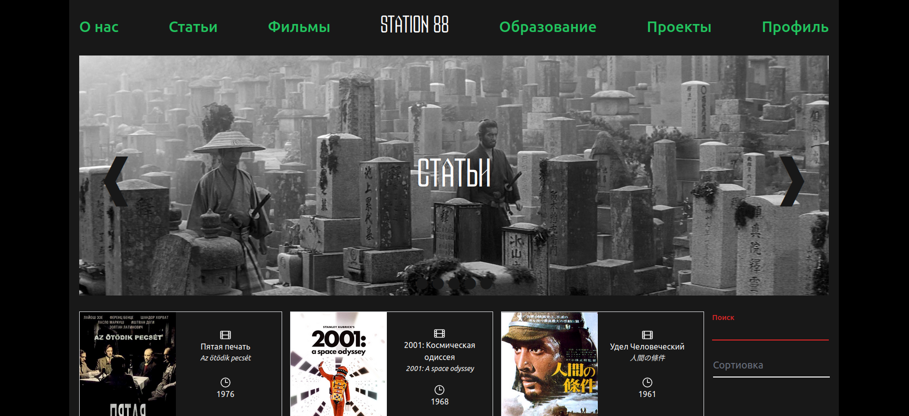

<h1> Station-88 <h2>

<h4> Application description</h4>

Station-88 is a movie production project, which indludes movie reviews, cinema articles, station-88 own projects and educational data.


<h4>Screen of application</h4>



<h4> Language Versions: </h4>
<p> python 3.10 </p>
<p> node v20.8.0 </p>


<h4>Steps to activate the project on linux machine:</h4>
<p> 1. Clone git repository to your machine:</p>

```
git clone https://github.com/lukash-ST88/Station-88.git
```

<p> 2. Setup backend - create and activate virtual environment: </p>

```
cd backend

python -m venv [name]

source [name]/bin/activate
```
<p>3. Install all requirements: </p>

```
pip install -r requirements.txt 
```

<p> 4. Create .env file and fill it with your own database and backend data: </p>

```
SECRET_KEY=some-secret-key

ALLOWED_HOSTS=127.0.0.1 localhost

POSTGRES_ENGINE=django-backend
POSTGRES_USER=user
POSTGRES_PASSWORD=pass
POSTGRES_HOST=localhost
POSTGRES_PORT=5432
POSTGRES_NAME=name
```
<p> 5. Migrate data to database:</p>

```
cd station88back
python3 manage.py migrate
```
<p> 6. Run the server side: </p>

```
python3 manage.py runserver
```
<p> 7. Setup frontend - install all requirements:</p>

```
cd frontend_ts

npm install 
```
<p> 8. Start the client side:</p>

```
npm start
```